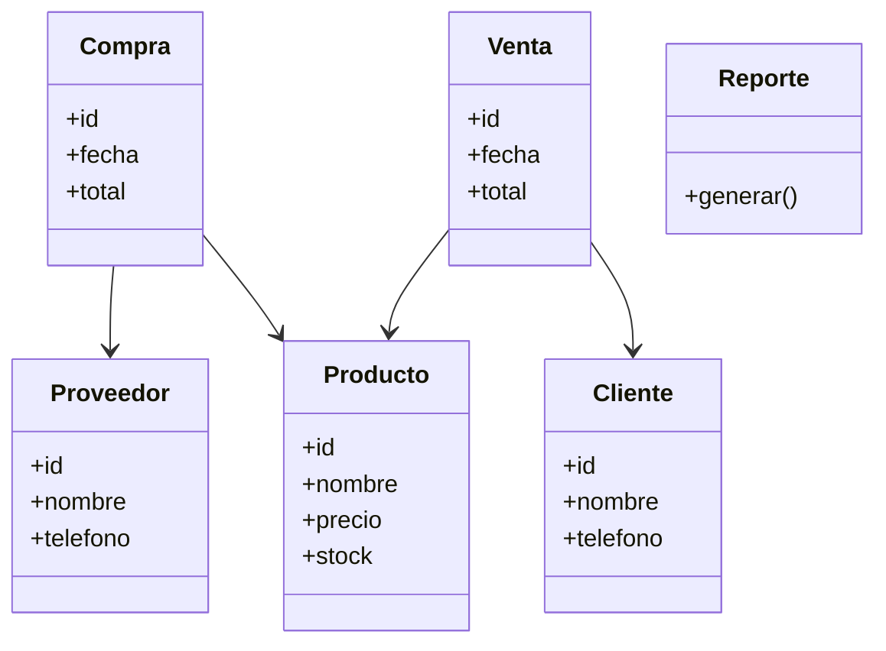

```mermaid
classDiagram

class Producto{
+id
+nombre
+precio
+stock
}

class Cliente{
+id
+nombre
+telefono
}

class Proveedor{
+id
+nombre
+telefono
}

class Compra{
+id
+fecha
+total
}

class Venta{
+id
+fecha
+total
}

class Reporte{
+generar()
}

Compra --> Proveedor
Venta --> Cliente
Venta --> Producto
Compra --> Producto
```